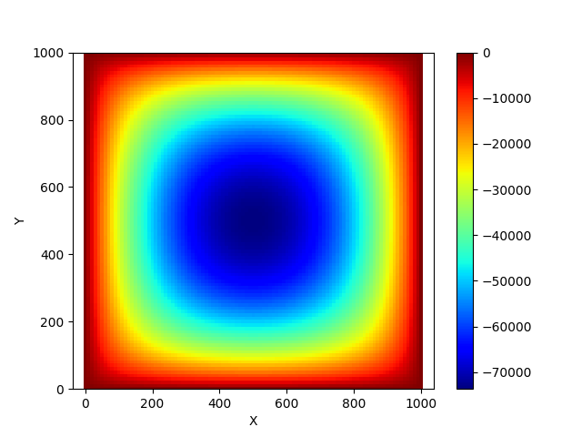

# Portfolio
---
## Data Science

### Customer Churn Prediction on Home Credit Default Risk Dataset

This project utilized the Home Credit Default Risk dataset to develop a machine learning-based model for predicting default risk, with imbalanced target data (91.93% vs 8.07%). After imputing missing values, applying one-hot encoding, and creating features, the Random Forest Classifier (RFC) model achieved 87% accuracy and 0.77 AUC-ROC.

 

 

---
### Real-time Forecasting of Global COVID-19 Trends with Random Forest Classifier

Through this project, we developed a Random Forest-based predictive model that accurately projects global COVID-19 case trends. The model was evaluated using metrics such as RMSE and MAE, demonstrating its effectiveness in predicting the number of new cases while identifying regions with potential case surges.

 

 

---
### Kaggle Competition: Predict Ames House Price using Lasso, Ridge, XGBoost and LightGBM

I performed comprehensive EDA to understand important variables, handled missing values, outliers, performed feature engineering, and ensembled machine learning models to predict house prices. My best model had Mean Absolute Error (MAE) of 12293.919, ranking <b>95/15502</b>, approximately <b>top 0.6%</b> in the Kaggle leaderboard.

 

 

---
## Computational Physics

### Finite Difference Time Domain

Finite Difference Time Domain (FDTD) is a numerical method used to solve partial differential equations (PDEs) that describe electromagnetic wave propagation. It is a time-domain approach that discretizes both space and time, representing the fields at each point on a grid and advancing the solution through time using iterative calculations. I have implemented a Python-based Finite Element Method to solve the Laplace equation in a square domain with homogeneous Dirichlet boundary conditions (the boundary values on each side of the domain zero) using matrix methods.

 

 

---
