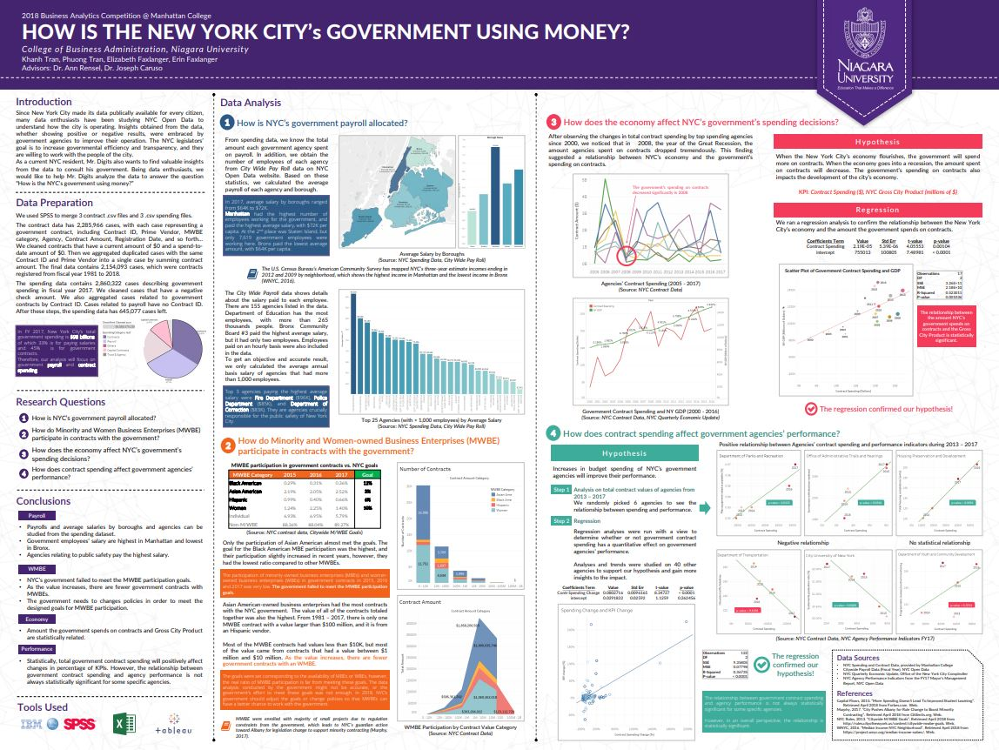

# Portfolio
---
## Data Science

### Customer Churn Prediction with CRISP-DM Framework on Home Credit Risk Dataset

After my team preprocessed a dataset of 10K credit applications and built machine learning models to predict credit default risk, I built an interactive user interface with Streamlit and hosted the web app on Heroku server.

 

 

---
### Kaggle Competition: Predict Ames House Price using Lasso, Ridge, XGBoost and LightGBM

I performed comprehensive EDA to understand important variables, handled missing values, outliers, performed feature engineering, and ensembled machine learning models to predict house prices. My best model had Mean Absolute Error (MAE) of 12293.919, ranking <b>95/15502</b>, approximately <b>top 0.6%</b> in the Kaggle leaderboard.

 

 

---
### Predict Breast Cancer with RF, PCA and SVM using Python

In this project I am going to perform comprehensive EDA on the breast cancer dataset, then transform the data using Principal Components Analysis (PCA) and use Support Vector Machine (SVM) model to predict whether a patient has breast cancer.

 

 

---
### Business Analytics Conference 2018: How is NYC's Government Using Money?

In three-month research and a two-day hackathon, I led a team of four students to discover insights from 6 million records of NYC and Boston government spending data sets and won runner-up prize for the best research poster out of 18 participating colleges.

 

 

---

## Computational Physics

### Finite Difference Time Domain

Finite Difference Time Domain (FDTD) is a numerical method used to solve partial differential equations (PDEs) that describe electromagnetic wave propagation. It is a time-domain approach that discretizes both space and time, representing the fields at each point on a grid and advancing the solution through time using iterative calculations. I have implemented a Python-based Finite Element Method to solve the Laplace equation in a square domain with homogeneous Dirichlet boundary conditions (the boundary values on each side of the domain zero) using matrix methods.

 

 

---

© 2020 Khanh Tran. Powered by Jekyll and the Minimal Theme.

